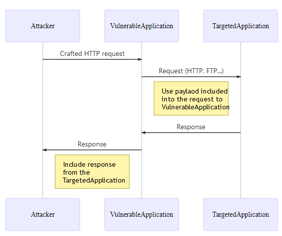

# Mandatory markdown format rules

# Introduction

The objective of the cheat sheet is to provide advices regarding the protection against [Server Side Request Forgery](https://www.acunetix.com/blog/articles/server-side-request-forgery-vulnerability/) attack.

**S**erver **S**ide **R**equest **F**orgery will be named **SSRF** in the rest of the cheat sheet.

This cheat sheet will focus on the defense point of view and will not explains how to perform this attack. This [talk](../assets/Server_Side_Request_Forgery_Prevention_Cheat_Sheet_Orange_Tsai_Talk.pdf) from the security researcher [Orange Tsai](https://twitter.com/orange_8361) provides deep advices about how to perform this kind of attack.

# Context

Sometime, an application need to perform request to another application, often located on other network, to perform a specific task. Depending of the business case, it can happen that information from the user are needed to perform the action.

*Example:* 

We can imagine an web application that receive and use the information coming a user like the firstname/lastname/birhtdate/email/SSN to create a profile into an HR system via a request to this HR system. 

Basically, the user cannot reach the HR system directly but if the web application in charge of receiving the user information is vulnerable to SSRF then the user can leverage it to access the HR system. The user use the web application as a proxy to the HR system, jumping accross the different networks in which the web application and the HR system are located.

Overview of an SSRF common flow:



*Note:* SSRF is not limited to HTTP protocol, even if often the first request performed by the attacker leverage the HTTP protocol, the second request (performed by the vulnerable application, the SSRF in fact) can use different protocol like HTTP, FTP, SMTP, SMB and so on...It depends on the technical need of the vulnerable application to perform the normal expected job on the other application on which the request is sent.

# Objective

```
Describe the objective of the CS.
What the CS will bring to the reader.
```

# Proposition

```
1. Describe how to address the security issues in a 
possible technology agnostic approach.

2. Using your POC, describe your solution proposal 
in the more teaching possible way.
```

# Authors and Primary Editors

Firstname Lastname - email@email.com

# Tools and code used for schemas

* [Mermaid Online Editor](https://mermaidjs.github.io/mermaid-live-editor).
* [Mermaid documentation](https://mermaidjs.github.io/).

Mermaid code for SSRF common flow (printscreen are used to capture PNG image inserted into this cheat sheet):

```text
sequenceDiagram
    participant Attacker
    participant VulnerableApplication
    participant TargetedApplication
    Attacker->>VulnerableApplication: Crafted HTTP request
    VulnerableApplication->>TargetedApplication: Request (HTTP, FTP...)
    Note left of TargetedApplication: Use paylaod included<br>into the request to<br>VulnerableApplication
    TargetedApplication->>VulnerableApplication: Response 
    VulnerableApplication->>Attacker: Response
    Note left of VulnerableApplication: Include response<br>from the<br>TargetedApplication
```